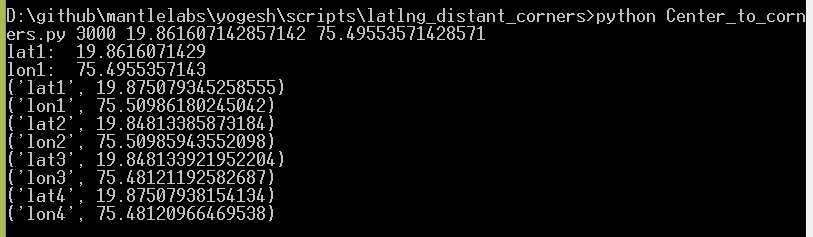

# latlng_distant_corners

Python Library Required:- 
1. math
2. sys

Input:-  
The python code Center_to_corners.py will compute the four corner cordinates of a square around the provided lat long. The square will be such that provided lat long will lie in center and the distance provided will be the sides of the square. Output is 4 lat long pairs that represent top-right, bottom-right, bottom-left and top-left corners.

Syntax:-  
python Center_to_corners.py distance_in_metres latitude longitude

where,  
distance_in_metres is Side of the square around the center in metres;  
Latitude of center in degree;  
Longitude of center in degree;  

Output:-  
Latitude and longitude for all 4 corner points of the square.  

Example:-  

  
python Center_to_corners.py 1500 47.1009358604 5.0074005580839795
